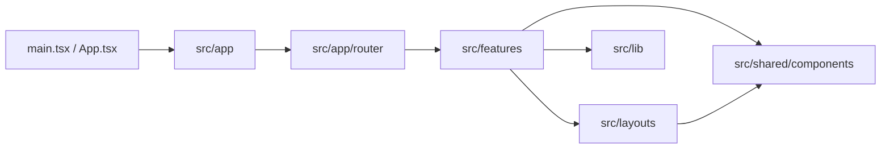

# Architecture

## Core Principle

Organize code by product feature. A feature owns its pages, business-specific components, state, and domain types. App-wide composition belongs in `src/app`; reusable visual primitives belong in `src/shared/components`.

```text
src/
  main.tsx                  Browser entry point
  App.tsx                   Provider and router composition
  app/
    router/                 Public, admin, user, and compatibility routes
    components/             App-wide loading and feedback UI
    messages/               Central user-facing operation messages
    stores/                 App-wide UI state only
    providers.tsx           Router, auth, loading, and feedback providers
  features/
    auth/                   Session, profiles, roles, permissions, auth pages
    <feature>/              Pages, feature UI, state, and domain types
  layouts/                  Admin/client shells, topbar, and sidebars
  shared/components/        Design-system components with no feature ownership
  lib/                      Framework-agnostic utilities and startup helpers
```

## Dependency Direction



Keep dependencies moving toward reusable layers. Shared components must not import feature pages or stores. Feature-to-feature imports should use the owning feature's `index.ts` public API when practical.

## Feature Contract

A typical feature has this shape:

```text
features/projects/
  index.ts                  Public exports used by other folders
  pages/                    Route-level screens
  components/               Project-specific UI
  stores/                   Zustand state and mutations
  types.ts                  Project domain types
```

Optional folders are appropriate only when they own real behavior:

- `access/` for feature-specific policy.
- `data/` for static configuration that is part of the product.
- `services/` for an active external boundary. Do not add no-op service wrappers.

## Authentication Ownership

All authentication code lives in `src/features/auth`:

```text
features/auth/
  access/
    roleAccess.ts           Role labels, staff checks, default route
    permissions.ts          Resource/action permission matrix
  components/AuthGate.tsx  Session initialization and route flow
  pages/                    Sign-in and password screens
  stores/authStore.ts       Active session and profile state
  authMode.ts               Local role profiles
  types.ts                  AuthProfile and AuthRole domain types
  index.ts                  Public auth API
```

Other features should import auth state, types, and access helpers from `@/src/features/auth`. Auth internals should use relative imports to avoid circular public-index imports.

## Routing Ownership

Routing lives in `src/app/router`:

- `publicRoutes.tsx` owns auth, landing, and onboarding routes.
- `userRoutes.tsx` owns canonical `/user/*` routes.
- `adminRoutes.tsx` owns canonical `/admin/*` routes.
- `legacyRoutes.tsx` contains compatibility redirects only.
- `AppRoutes.tsx` applies route gates and renders the registry.

Add new product pages to a canonical route group. Add a compatibility redirect only when an old URL must continue to work.

## State And CRUD

Feature stores are the mutation boundary. Pages collect input and call store actions; stores validate or normalize input, update Zustand state, and expose loading/error state when needed. Components read store selectors and render the result.

Keep browser persistence explicit and feature-owned. Do not read or write local storage directly from page components.

## Future Backend Boundary

When a remote backend is introduced, preserve the feature API consumed by pages. Add a real adapter or repository inside the owning feature and keep provider-specific SDK types out of domain types and presentational components. This allows storage to change without rewriting every screen.

## UI Ownership

- Use `src/shared/components` for reusable controls and display primitives.
- Use `src/layouts` for full application shells and navigation.
- Keep business-specific UI inside its feature.
- Reuse a shared component before adding native controls or a new primitive.
- Export cross-feature components through the feature `index.ts`; keep internal helpers private.
