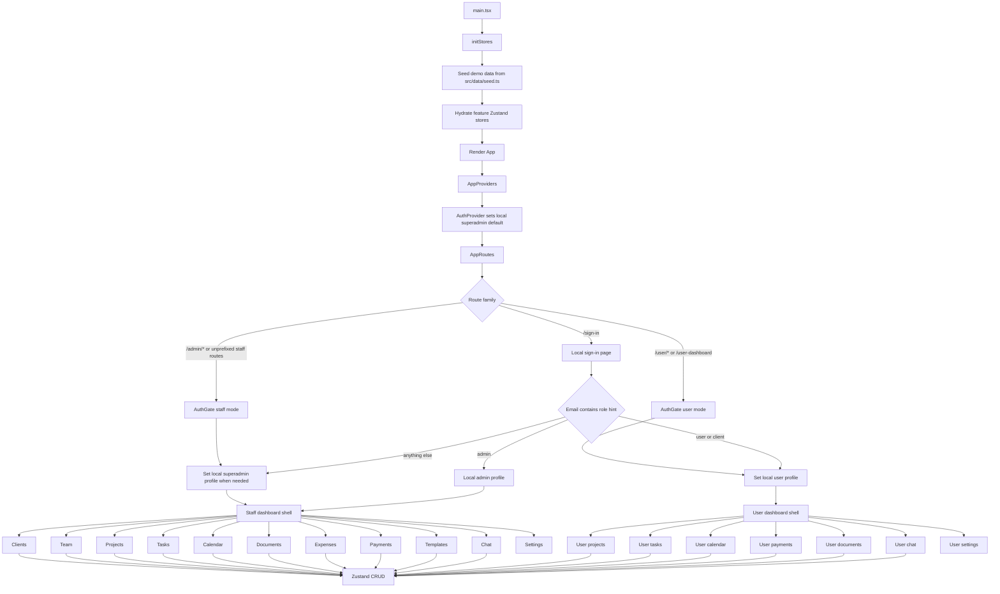

# Local App Flow

The app starts with local Zustand state only. There is no remote auth gate and no remote database requirement.

## Route Map

Staff dashboard routes are available with and without the `/admin` prefix:

- `/admin` and `/dashboard`
- `/admin/clients` and `/clients`
- `/admin/projects` and `/projects`
- `/admin/tasks` and `/tasks`
- `/admin/calendar` and `/calendar`
- `/admin/documents` and `/documents`
- `/admin/team` and `/team`
- `/admin/expenses` and `/expenses`
- `/admin/templates/pricing` and `/templates/pricing`

User dashboard routes:

- `/user`
- `/user-dashboard`
- `/user/projects`
- `/user/tasks`
- `/user/calendar`
- `/user/payments`
- `/user/documents`
- `/user/chat`
- `/user/settings`

## Feature Ownership

- `src/features/auth` owns local role selection.
- `src/lib/initStores.ts` owns startup hydration.
- Each feature store owns its local CRUD mutations.
- `src/app/routes.tsx` owns route aliases and dashboard entry points.
