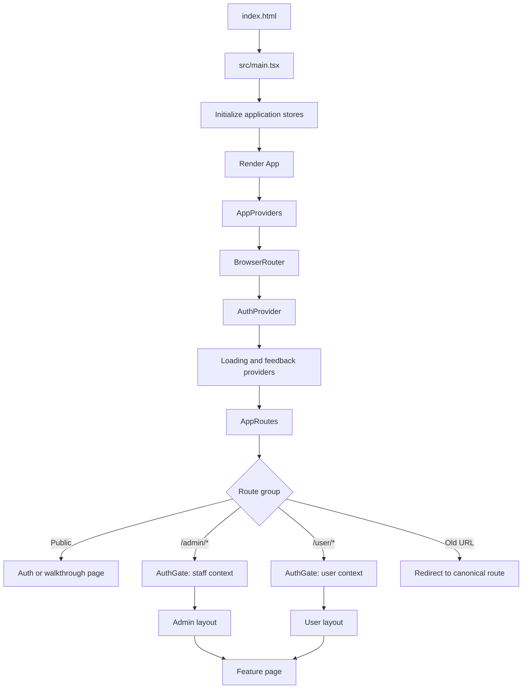
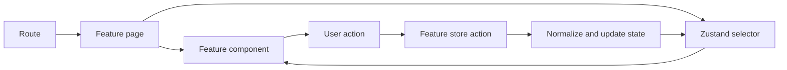

# Application Flow

## Startup To Screen



## Session And Onboarding

```mermaid
flowchart TD
  A[AuthProvider starts session] --> B[authStore is ready]
  B --> C{Password change required?}
  C -->|Yes| D[/change-password]
  C -->|No| E{Walkthrough complete?}
  E -->|No| F[/walkthrough]
  E -->|Yes| G{Profile role}
  D --> E
  F --> G
  G -->|superadmin or admin| H[/admin]
  G -->|user| I[/user]
```

`AuthGate` prepares the role context for a route family. `AuthLanding` chooses the correct dashboard entry. The auth store owns the active local profile and session actions.

## Page And CRUD Flow



Keep data mutations in the owning store. Pages should coordinate forms, navigation, and feedback; reusable components should receive values and callbacks through props.

## Route Families

```text
Public
  /
  /sign-in
  /change-password
  /forgot-password
  /reset-password
  /walkthrough

Staff
  /admin
  /admin/clients
  /admin/team
  /admin/users
  /admin/projects
  /admin/tasks
  /admin/calendar
  /admin/payments
  /admin/documents
  /admin/templates/*
  /admin/chat
  /admin/expenses
  /admin/settings

Client
  /user
  /user/projects
  /user/tasks
  /user/calendar
  /user/payments
  /user/documents
  /user/chat
  /user/settings
```

Canonical routes are defined in `src/app/router`. Unprefixed historical URLs are redirects and should not become a second route registry.
